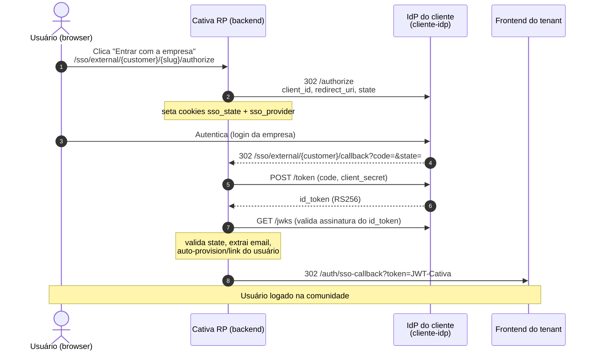

# cliente-idp

IdP OIDC **mock** que simula o provedor de identidade do cliente. A Cativa age como Relying Party e federa para cá (fluxo `ExternalIdp`).

## O que ele expõe

- `GET /.well-known/openid-configuration` — discovery (issuer = `PUBLIC_URL`)
- `GET /jwks` — chave pública RS256
- `GET /authorize` — tela de "login" do IdP; autentica o usuário de demo
- `GET /approve` — emite o `code` e redireciona pro callback da Cativa
- `POST /token` — troca `code` por `id_token` RS256 (com `email`, que a Cativa exige)
- `GET /userinfo` — opcional

## Restrição importante (prod)

A Cativa em produção busca `discovery`, `jwks` e `token` **deste servidor, pela internet, server-side**. `localhost` não é alcançável. Suba um túnel e ponha a URL pública em `PUBLIC_URL`:

```bash
cloudflared tunnel --url http://localhost:4010
# ou
ngrok http 4010
```

## Rodar

```bash
cd projects/sso-demos/cliente-idp
cp .env.example .env        # ajuste PUBLIC_URL para a URL do túnel
npm install
npm start
```

## Registrar como Identity Provider no tenant

No admin SSO do tenant (endpoints `Cativa.Sso` admin — `CreateIdentityProvider`), crie um provider com:

| Campo | Valor |
|---|---|
| `MetadataUrl` | `{PUBLIC_URL}/.well-known/openid-configuration` |
| `ClientId` | `cativa-federated-demo` (o mesmo do `.env`) |
| `ClientSecret` | `super-secret-demo` (o mesmo do `.env`) |
| `Scopes` | `openid profile email` |
| `AutoProvision` | `true` (cria o usuário no 1º login) |
| `Slug` | ex.: `cliente-demo` (usado na URL de início) |

> O `redirect_uri` que a Cativa usa é fixo: `{ApiBaseUrl}/sso/external/{customer}/callback`. Este IdP aceita qualquer `redirect_uri` recebido (é mock), então não precisa configurar nada além do acima.

## Disparar o fluxo

Abra no browser:

```
https://apis.cativalab.digital/tenant/api/v2/sso/external/{customer}/{slug}/authorize
```

`{customer}` = slug do tenant, `{slug}` = o `Slug` do provider registrado. Sequência:

1. Cativa redireciona pra `{PUBLIC_URL}/authorize` (este IdP).
2. Você clica "Autenticar"; o IdP devolve `code` pro callback da Cativa.
3. Cativa troca o `code` aqui no `/token`, valida o `id_token` via `/jwks`, extrai o email, faz auto-provision/link do usuário e emite um JWT Cativa.
4. Cativa redireciona pro frontend do tenant em `{origin}/auth/sso-callback?token=...` já logado.

## Nota sobre múltiplos providers

O callback da Cativa identifica o provider por um cookie `sso_provider` setado no início, com fallback "se só houver 1 provider habilitado". Para um teste limpo, deixe **apenas este** provider habilitado no tenant.

## Fluxo de cadastro/login (cliente como IdP)

### Diagrama de sequência



### Versão leiga

Imagine uma empresa que comprou a comunidade Cativa para os funcionários. Os funcionários não querem criar uma senha nova: querem entrar com o mesmo login que usam para o e-mail da empresa.

1. Na tela de entrada da comunidade Cativa, a pessoa clica em **"Entrar com a conta da empresa"**.
2. A Cativa **encaminha** a pessoa para o sistema de login da própria empresa (o IdP do cliente). A Cativa não vê a senha corporativa.
3. A pessoa faz login no sistema da empresa, como faz todo dia.
4. O sistema da empresa devolve a pessoa para a Cativa com um "comprovante" dizendo "esse é o funcionário fulano, email tal".
5. A Cativa lê esse comprovante e:
   - se já existe um usuário ligado a ele, faz login direto;
   - **se é a primeira vez, cria a conta automaticamente** (cadastro), usando nome e email que vieram da empresa.
6. A pessoa cai logada dentro da comunidade.

Aqui o **cadastro é automático**: a primeira vez que um funcionário entra, a conta dele na Cativa nasce sozinha a partir dos dados do IdP da empresa. Quem garante a identidade é a empresa, não a Cativa.

### Versão técnica

A Cativa age como **Relying Party**; o IdP do cliente é o servidor de autorização. Fluxo OIDC authorization code (sem PKCE neste caminho; proteção CSRF via `state` em cookie).

**Pré-passo (config): registrar o Identity Provider no tenant** (admin SSO, `CreateIdentityProvider`): `Slug`, `ClientId`, `ClientSecret`, `Scopes`, e `MetadataUrl` (discovery do IdP) ou os endpoints crus (`AuthorizationEndpoint`/`TokenEndpoint`/`JwksUri`), além de `AutoProvision` e `DefaultRole`.

1. **Início.** O usuário acessa:
   ```
   GET /sso/external/{customer}/{slug}/authorize
   ```
   O backend resolve o customer pelo path, busca o provider pelo `slug`, resolve o `authorization_endpoint` (via `MetadataUrl`/discovery ou campo direto), gera um `state` aleatório, e **seta dois cookies** `HttpOnly`/`Secure`/`SameSite=Lax` com escopo no path do callback: `sso_state` (anti-CSRF) e `sso_provider` (qual provider está sendo usado). Então redireciona (302) para o IdP do cliente:
   ```
   {authorization_endpoint}?client_id=...&redirect_uri={ApiBaseUrl}/sso/external/{customer}/callback
       &scope=...&state=...&response_type=code
   ```
2. **Login no IdP do cliente.** O IdP autentica o usuário e redireciona de volta para o `redirect_uri` da Cativa com `?code=...&state=...`.
3. **Callback.** `GET /sso/external/{customer}/callback`:
   - valida `state` recebido contra o cookie `sso_state` (rejeita se diverge), apaga o cookie;
   - identifica o provider pelo cookie `sso_provider` (fallback: se houver exatamente 1 provider habilitado, usa ele; com vários e sem cookie, falha);
   - troca o `code` por tokens no `token_endpoint` do IdP (`client_id`/`client_secret` do provider, `redirect_uri` idêntico);
   - **valida o `id_token`**: assinatura via `jwks_uri` do IdP, `audience` = `ClientId` do provider, e `issuer` (só validado quando há `MetadataUrl`; sem ela, valida assinatura + audience + expiração e pula issuer);
   - exige `email` no token (sem email, aborta com erro).
4. **Resolução do usuário.**
   - Procura `SsoExternalLink` por `(providerId, sub)`. Se existe, atualiza `LastLogin` e usa o `UserId` vinculado.
   - Se não existe e `AutoProvision=true`: chama o `UserProvisioningService` com `customerId`, `email`, `given_name`/`family_name`, `picture`, `DefaultRole`. Cria o usuário e grava um `SsoExternalLink` novo (link `sub` externo para `UserId` Cativa).
   - Se não existe e `AutoProvision=false`: aborta ("criação automática desabilitada").
5. **Emissão do token Cativa.** Gera um **JWT Cativa próprio** (o HS256 normal de login, não o ES256 do IdP) com TTL curto (1 min) e redireciona o browser para o frontend do tenant:
   ```
   {customer.Origin}/auth/sso-callback?token=<jwt>
   ```
   O frontend lê o token da URL, limpa a URL imediatamente, e a partir daí a sessão é a sessão normal da comunidade.

### Diferença-chave entre os dois casos

| | Caso 1 (Cativa = IdP) | Caso 2 (Cliente = IdP) |
|---|---|---|
| Quem autentica | A Cativa | O IdP do cliente |
| Quem é o Relying Party | O app de terceiro | A Cativa |
| Cadastro | Não cria (usuário já é membro) | Auto-provisiona no 1º login |
| Token que a app/usuário recebe | `access_token` ES256 `aud=cativa-api` + `id_token` | JWT Cativa HS256 de sessão |
| PKCE | Sim (S256) | Não (CSRF via `state` em cookie) |
| Assinatura do `id_token` consumido | ES256 (chave da Cativa) | RS256 / o que o IdP do cliente usar |
