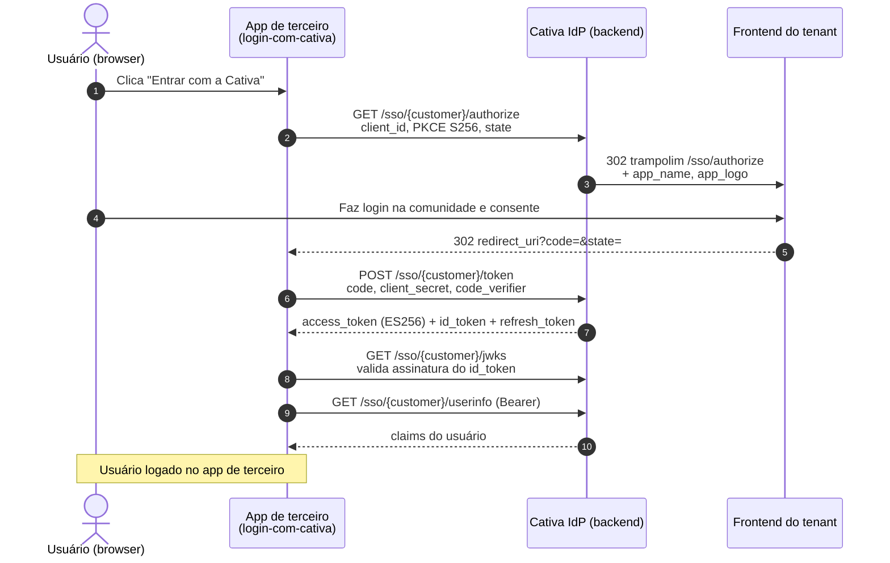

# login-com-cativa

Relying Party OIDC que faz **"Entrar com a Cativa"**. A Cativa é o IdP (fluxo `CativaIdp`).

## O que ele faz

1. No boot, lê o discovery `{CATIVA_API_BASE}/sso/{CUSTOMER}/.well-known/openid-configuration`.
2. Se não houver `CLIENT_ID` no `.env`, faz **Dynamic Client Registration** (RFC 7591, endpoint aberto `/sso/{customer}/register`) e imprime `client_id`/`client_secret` no console.
3. `/login` → gera PKCE (S256) + `state`, redireciona pro `authorize` da Cativa.
4. A Cativa faz trampolim pro frontend do tenant, o usuário loga na comunidade e consente; volta pro `/callback` com `code`.
5. `/callback` troca o `code` no `/token` (PKCE + `client_secret_post`), **verifica a assinatura ES256 do `id_token` via JWKS**, chama `/userinfo` e mostra tudo.

## Rodar

```bash
cd projects/sso-demos/login-com-cativa
cp .env.example .env        # ajuste CUSTOMER para um tenant real
npm install
npm start
# abra http://localhost:4000
```

Na primeira execução, copie o `CLIENT_ID`/`CLIENT_SECRET` impressos pro `.env` pra reutilizar o mesmo client.

## Observações

- O `access_token` é ES256 com `aud=cativa-api` e já carrega os claims da API (UserId/Role/CustomerId). Dá pra chamar `/tenant/api/v2/*` direto com ele.
- O `redirect_uri` precisa bater exatamente com o registrado. Mudou a porta? Re-registre (apague `CLIENT_ID` do `.env`).
- O login de verdade acontece no frontend do tenant (`{origin}/sso/authorize`); este app só inicia e recebe o resultado.

## Fluxo de cadastro/login (Cativa como IdP)

### Diagrama de sequência



### Versão leiga

Pensa no botão "Entrar com o Google" que você vê em todo lugar. Aqui é a mesma coisa, só que "Entrar com a Cativa".

1. Você está no app de terceiro e clica em **"Entrar com a Cativa"**.
2. O app te leva para uma tela **da própria Cativa** (a tela de login da comunidade). O app não vê sua senha em nenhum momento.
3. Você faz login ali (ou já está logado) e a Cativa pergunta se você autoriza o app a saber quem você é.
4. Você confirma. A Cativa te manda de volta para o app, junto com um "comprovante" temporário.
5. O app troca esse comprovante, **nos bastidores**, por um "crachá" oficial que diz quem você é (nome, email, foto).
6. Pronto, você está logado no app de terceiro. Quem garantiu sua identidade foi a Cativa, não o app.

O ponto central: sua senha nunca passa pelo app. A Cativa só entrega um crachá dizendo "essa pessoa é fulano, confirmado por nós".

Sobre **cadastro**: nesse caso não tem cadastro novo. A pessoa já é membro da comunidade Cativa. O app só passa a reconhecê-la.

### Versão técnica

Fluxo OAuth 2.0 / OIDC **authorization code + PKCE (S256)**. Base: `https://apis.cativalab.digital/tenant/api/v2/sso/{customer}`.

**Pré-passo (uma vez): registro do client.** O app faz `POST /sso/{customer}/register` (Dynamic Client Registration, RFC 7591, endpoint aberto) com `redirect_uris`. Recebe `client_id` + `client_secret`. Em código real isso normalmente é provisionado pelo admin do tenant em vez de DCR aberto.

1. **Authorization request.** O app gera um `code_verifier` aleatório, deriva `code_challenge = BASE64URL(SHA256(verifier))`, gera um `state`, e redireciona o browser para:
   ```
   GET /sso/{customer}/authorize
       ?client_id=...&redirect_uri=...&response_type=code
       &scope=openid profile email
       &code_challenge=...&code_challenge_method=S256&state=...
   ```
2. **Trampolim para o frontend do tenant.** O endpoint `authorize` valida `client_id`, `redirect_uri` (contra os registrados) e scopes, e então redireciona (302) para o frontend do tenant: `{customer.Origin}/sso/authorize?...` repassando os mesmos parâmetros + `app_name`/`app_logo`. É no frontend da comunidade que o usuário de fato autentica e consente. O backend não tem tela de login própria.
3. **Emissão do code.** Após o usuário aprovar, o frontend gera o `authorization_code` (persistido como hash SHA-256, com `code_challenge`, `redirect_uri`, `client_id`, `user_id`, expiração e flag `consumed`) e redireciona o browser de volta para o `redirect_uri` do app com `?code=...&state=...`.
4. **Token exchange.** O app valida o `state`, e faz `POST /sso/{customer}/token` com `Content-Type: application/x-www-form-urlencoded`:
   ```
   grant_type=authorization_code&code=...&client_id=...
   &client_secret=...&redirect_uri=...&code_verifier=...
   ```
   O backend valida `client_secret` (BCrypt), busca o code pelo hash, checa `consumed`/expiração/`client_id`/`redirect_uri`, **verifica o PKCE** (`SHA256(code_verifier) == code_challenge`), marca `consumed`, e responde:
   ```json
   { "access_token": "<ES256 JWT>", "token_type": "Bearer",
     "expires_in": 3600, "id_token": "<ES256 JWT>", "refresh_token": "<opaco>" }
   ```
5. **Características dos tokens.**
   - `access_token`: JWT **ES256**, `aud=cativa-api`, já com os claims da API (UserId, Role, CustomerId, CustomerName, Status). O mesmo token serve para chamar `/tenant/api/v2/*` direto (a API tem o esquema `CativaIdp` que aceita ES256, roteado pelo `alg` via policy-scheme `Smart`).
   - `id_token`: JWT ES256 com `sub`, `name`, `email`, `picture`.
   - `refresh_token`: opaco, persistido como hash, com **rotação** (no refresh grant o antigo é revogado e um novo é emitido).
6. **Validação e userinfo.** O app valida a assinatura do `id_token` contra o JWKS (`GET /sso/{customer}/jwks`, kid `cativa-sso-prod-1`) conferindo o `issuer`. Opcionalmente chama `GET /sso/{customer}/userinfo` com `Authorization: Bearer <access_token>` para reconfirmar os claims server-side.

Refresh posterior: `POST /token` com `grant_type=refresh_token` + `refresh_token` + credenciais do client, devolve `access_token` + `refresh_token` novos.
